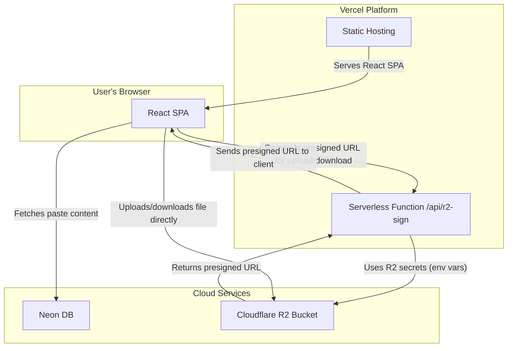

# 📝 Pastry

This project is **inspired by rentry**, a simple and elegant pastebin service. It provides a clean interface for creating and sharing text pastes anonymously, with support for both **permanent (passcode-protected)** and **shared guest pastes**. Built with React and Neon Database, it offers a modern, responsive experience for quick text sharing. 🚀

To run the project, first ensure you have **Node.js** installed. Then, navigate to the project directory, install dependencies with `npm install`, and start the development server with `npm run dev`. The app will be available at `http://localhost:3000`.

To use it, visit the homepage and choose between:
- **Admin mode**: Enter a passcode for permanent pastes 🔒
- **Guest mode**: Shared editable paste for all users 👥
	- Guests can upload files too (stored separately from admin uploads), with a 1 GB total limit.

Create or edit pastes in the editor, save them, and share the generated URLs. Guests can view and edit the same shared paste collaboratively. 📤

## Tech Stack & Architecture

This project uses a modern, serverless architecture designed for security and performance.

### Core Technologies

-   **Frontend**: [React](https://react.dev/) (with Vite) for a fast, responsive UI.
-   **Styling**: [Tailwind CSS](https://tailwindcss.com/) for rapid, utility-first styling.
-   **Database**: [Neon](https://neon.tech/) Serverless Postgres for data storage.
-   **File Storage**: [Cloudflare R2](https://www.cloudflare.com/developer-platform/r2/) for private, S3-compatible object storage.
-   **Deployment**: [Vercel](https://vercel.com/) for hosting the frontend and running serverless functions.

### Architecture Diagram

The application is designed to keep secrets and sensitive operations on the server-side, ensuring the frontend never handles API keys directly.

### How It Works

1.  The **React SPA** is served to the user from Vercel's static hosting.
2.  Text content is fetched directly from the **Neon Postgres** database.
3.  For file uploads/downloads, the client calls a **Vercel Serverless Function** (`/api/r2-sign`).
4.  This function, which securely accesses **Cloudflare R2** credentials from Vercel's environment variables, generates a short-lived, presigned URL.
5.  The client receives this URL and uses it to upload or download the file directly to/from the R2 bucket. This keeps the bucket private and secrets off the client.

